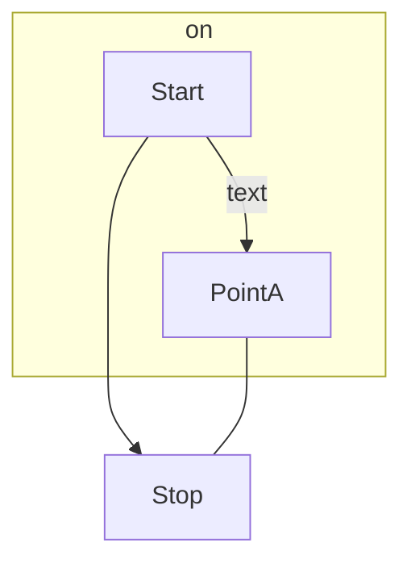

# マーメイド記法の練習

## ①VSCodeでmermaidを利用する方法や便利な拡張機能

## 使い方

1. 以下のMermaid Markdownをインストールします。


2. まず、vscodeで.mdファイルを作ります。
3. その後、以下のようにmermaidをキーワードにしてコードを記述します。

```
flowchart TD
    Start --> Stop
    subgraph on
    Start --> |text|PointA
    end
    PointA --- Stop
``` 

4. Ctrl+k,vでレビューすると以下のようになります。



5. 画面全体で表すとこんな感じですね。


## 便利な拡張機能

1. Visual Studio Code で Markdown Preview Mermaid Support をインストールします。
2. 検索すると以下のような画面で見つけることができます。


3. インストールすると使えるようになります。

以下のサイトを引用致しました。
https://usefuledge.com/vscodemermaidsupport.html


